# Credit Risk Analysis

## Overview of Project

### Purpose

The purpose of this project was to use imbalanced-learn and scikit-learn libraries to build and evaluate models using resampling to predict credit risk.

## Results

The balanced accuracy scores and classification reports of all six machine learning models are as follows:

- ### Naive Random Oversampling
    - Balanced Accuracy Score: 65%
    - Precision: 99%
    - Recall: 68%
    
    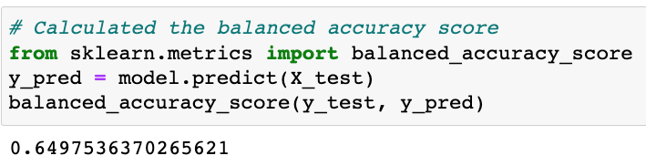
    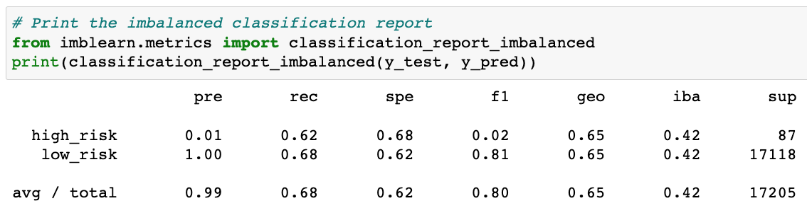

- ### SMOTE Oversampling
    - Balanced Accuracy Score: 64%
    - Precision: 99%
    - Recall: 66%
    
    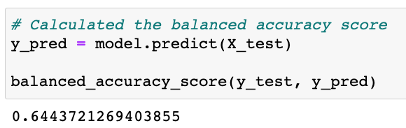
    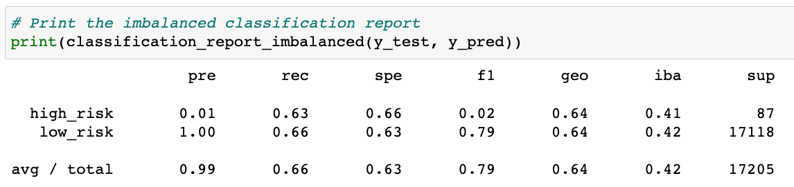

- ### Undersampling
    - Balanced Accuracy Score: 53%
    - Precision: 99%
    - Recall: 45%
    
    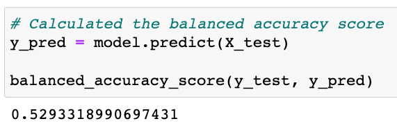
    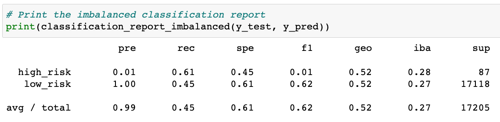

- ### Combination (Over and Under) Sampling
    - Balanced Accuracy Score: 53%
    - Precision: 99%
    - Recall: 57%
    
    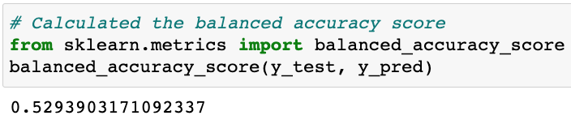
    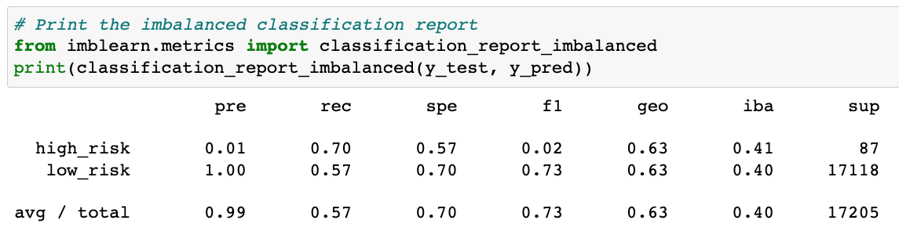

- ### Ensemble Learners: Balanced Random Forest Classifier
    - Balanced Accuracy Score: 79%
    - Precision: 99%
    - Recall: 67%
    
    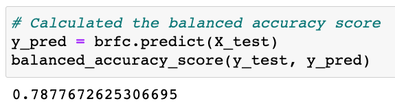
    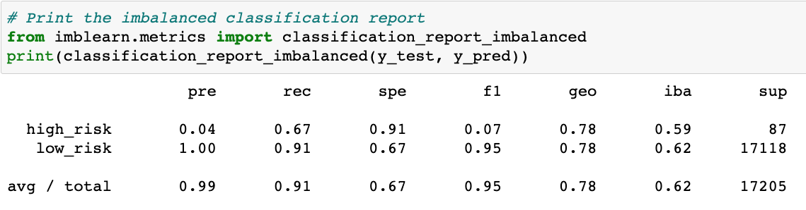

- ### Ensemble Learners: Easy Ensemble AdaBoost Classifier
    - Balanced Accuracy Score: 92%
    - Precision: 99%
    - Recall: 94%
    
    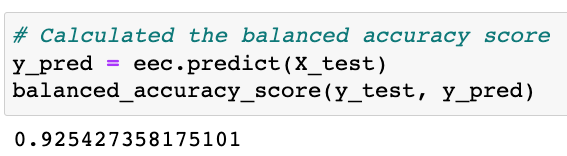
    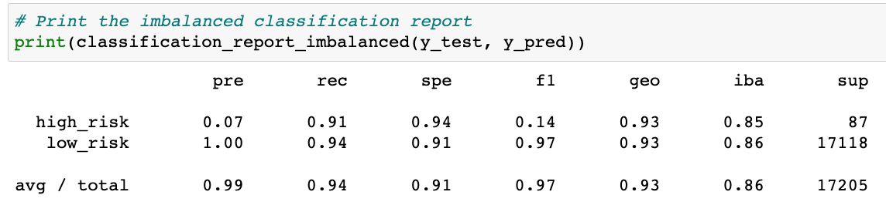

## Summary

There is a summary of the results (2 pt)
There is a recommendation on which model to use, or there is no recommendation with a justification (3 pt)